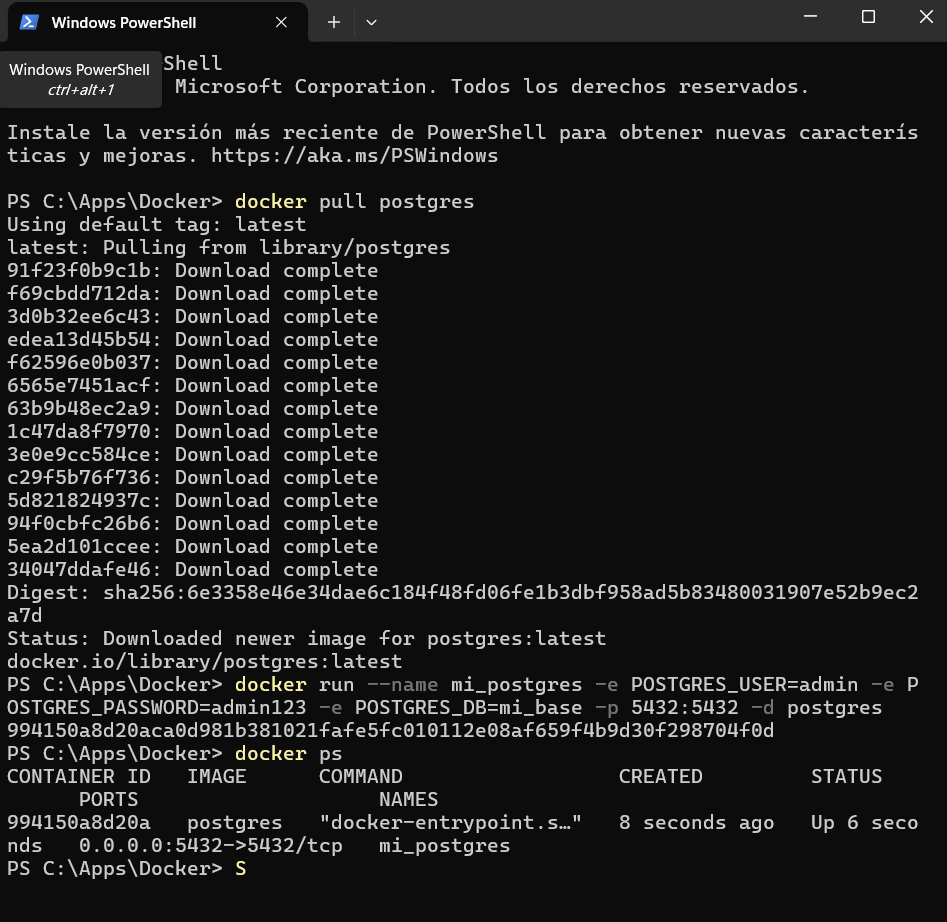
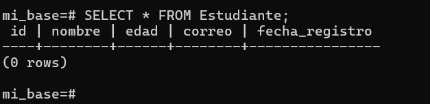
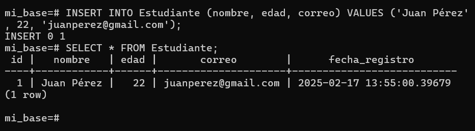
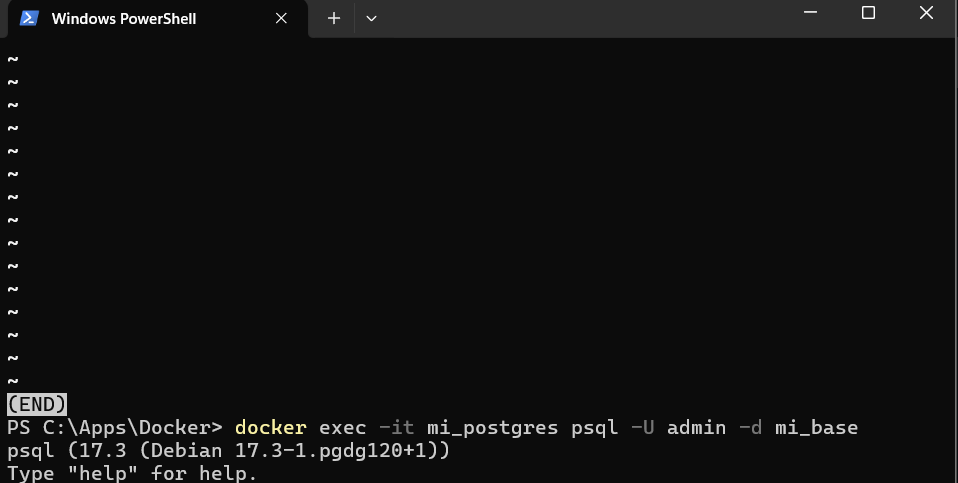

# Configuración de Docker con PostgreSQL

Ejecuion de postresql.

## descarga y abrir contenedor

# Crear tabla

## Insertar datos

hay un error que cuando llamo a la tabla con 

\d Estudiante

en el END no me deja tocar nada se queda ai por un largo rato tube que salir del contenedor y volver a llamarlo para ingresar los datos 
